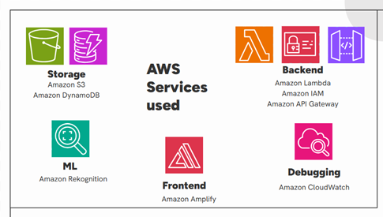
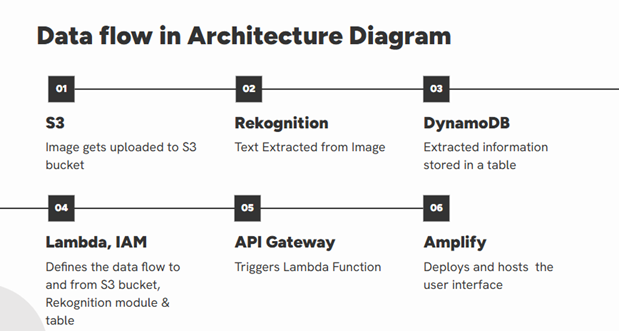
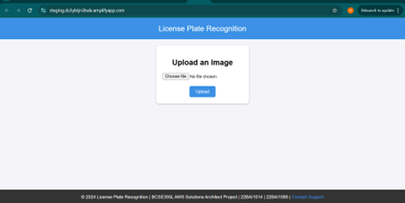
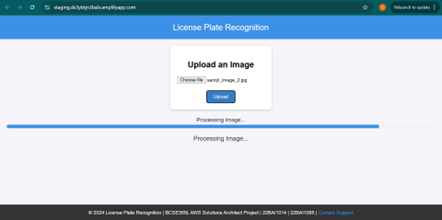
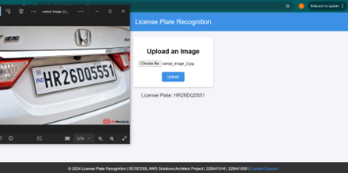

# License Plate Recognition – AWS Serverless App 🚗🔍

A fully serverless application that detects license plate numbers from uploaded images using AWS Rekognition, stores images in S3, and logs plate data in DynamoDB. Built using Lambda, API Gateway, and other AWS services — designed for smart city, parking, and traffic systems.

---

## 🎥 Demo Video

👉 [Click to Watch](https://youtu.be/Bh6bCZ0DPmw)

---

## ☁️ AWS Services Used

- **Storage**: Amazon S3, DynamoDB  
- **Backend**: Lambda, IAM, API Gateway  
- **Machine Learning**: Amazon Rekognition  
- **Frontend**: Amazon Amplify  
- **Debugging**: CloudWatch

---

## 🧠 System Overview

This project follows a fully serverless event-driven architecture using AWS. Image uploads are handled via a public API, OCR is performed using Rekognition, and plate metadata is stored for future lookup and analysis.

---

## 🗺️ System Architecture Diagram

> The architecture consists of an AWS-hosted pipeline with S3, Lambda, Rekognition, API Gateway, and DynamoDB.

---

## 🔁 Data Flow Diagram

> 1️⃣ Image is uploaded to **S3**  
> 2️⃣ **Rekognition** extracts license plate text  
> 3️⃣ **Lambda** processes and stores data  
> 4️⃣ **API Gateway** handles requests  
> 5️⃣ **DynamoDB** logs results  
> 6️⃣ **Amplify** can be used to host the frontend

---

## 🖼️ Output Screenshots

| Image | Description |
|-------|-------------|
|  | 📤 Image uploaded via API Gateway |
|  | 🔍 Rekognition detects the license plate |
|  | 🗂️ Metadata stored in DynamoDB |

---

## 🧰 Tools & Services Used

- **AWS Lambda**
- **Amazon Rekognition**
- **Amazon S3**
- **Amazon DynamoDB**
- **Amazon API Gateway**
- **Amazon CloudWatch**
- **Amazon Amplify**
- **Python**

---

## 💡 Use Cases

- Smart city surveillance
- Toll and traffic enforcement
- Parking management automation

---

## 👨‍💻 Contributors

- **Roshan A Rauof** 
- **Shireen Aliza Ali** 

---
